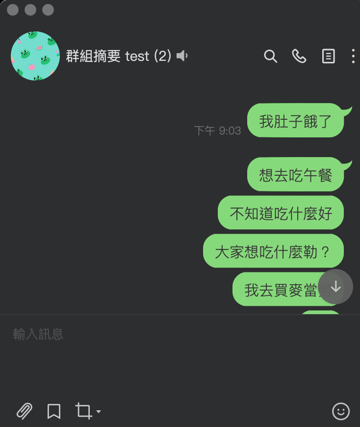
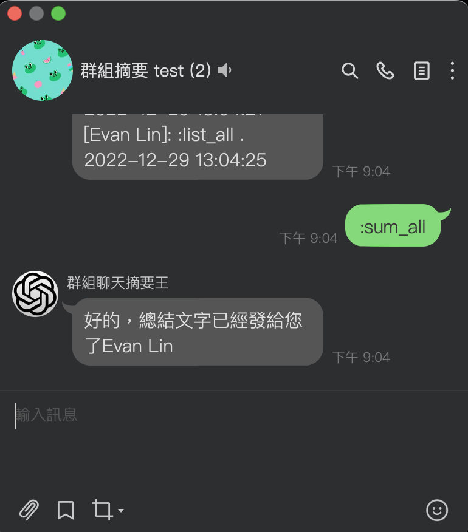
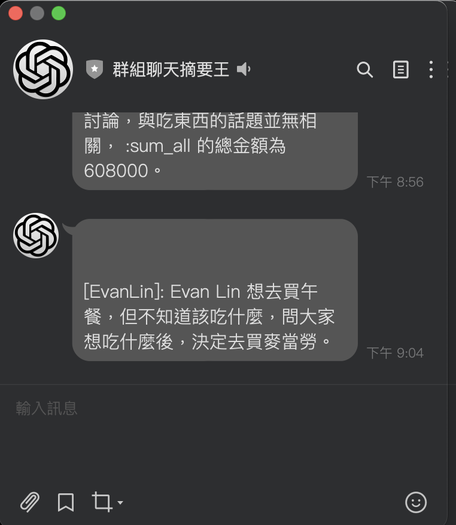

LINE Bot Chat Summarizer: Use ChatGPT to summarize your group chat as a chat summarizer with the LINE Bot Chat Summarizer
==============

    

中文 version, please check [Chinese Version](README.md)

Usage
=============

- Follow the deployment process in "How to install".

- Add the robot to the group chat room.

- Be able to remember the conversation in the group.

- Send a summary of the group's content privately to you.

Related commands
=============

- `:gpt xxx`: Chat directly with ChatGPT, you can ask him directly.

- `:list_all`: List the message records (all) in the group

- `:sum_all`: Do a message summary for you.

Related limitations
Currently, the original code of this LINE Bot is not bound to a database, so all conversation records are stored in memory. There may be drawbacks such as forgetting or being unable to store after a restart (the next day) or exceeding the limit.
How to use this
=============

### To obtain a LINE Bot API developer account

Make sure you are registered on the LINE developer console at <https://developers.line.biz/console/> if you want to use a LINE Bot.

Create a new Messaging Channel and get the "Channel Secret" on the "Basic Setting" tab.

Issue a "Channel Access Token" on the "Messaging API" tab.

Open the LINE OA manager from the "Basic Setting" tab and go to the Reply setting on the OA manager. Enable "webhook" there.

### To obtain an OpenAI API token

Register for an account on the OpenAI website at <https://openai.com/api/>.

Once you have an account, you can find your API token in the account settings page.

If you want to use the OpenAI API for development, you can find more information and instructions in the API documentation page.

Please note that the OpenAI API is only available to users who meet certain criteria. You can find more information about the usage conditions and limitations of the API in the API documentation page.

### Deploy this on Web Platform

You can choose [Heroku](https://www.heroku.com/) or [Render](http://render.com/)

#### Deploy this on Heroku

- Input `Channel Secret` and `Channel Access Token` and `ChatGptToken`.

#### Deploy this on Rener

- Input `Channel Secret` and `Channel Access Token` and `ChatGptToken`.

### Update LINE Bot

Remember your Web Platform server ID.

To set up the basic API in the LINE Bot Dashboard:

Set up your basic account information, including the "Callback URL" at <https://{YOUR_HEROKU_SERVER_ID}.herokuapp.com/callback>.
That's it! You're done.

License
---------------

Licensed under the Apache License, Version 2.0 (the "License");
you may not use this file except in compliance with the License.
You may obtain a copy of the License at

<http://www.apache.org/licenses/LICENSE-2.0>

Unless required by applicable law or agreed to in writing, software
distributed under the License is distributed on an "AS IS" BASIS,
WITHOUT WARRANTIES OR CONDITIONS OF ANY KIND, either express or implied.
See the License for the specific language governing permissions and
limitations under the License.
